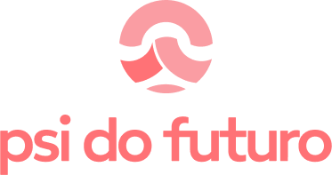

# Technical Test by Isaque Böck

## 📄 Descrição

    Projeto desenvolvido para o teste técnido da Psi do Futuro, acompanhe os commits para analisar a evolução e tomadas de decisão do projeto. :)

## 🏃‍♂️ Executando o projeto

    Para executar o projeto na sua máquina clone esse projeto, mas antes certifique-se que você tenha o Node.js instalado na sua máquina. 

 
    
Para executar o clone rode o comando abaixo:

    git clone git@github.com:isaquebock/psidofuturo.git

## 🛠️ Testes

### Testes unitários 
Para executar os testes unitários rode o comando abaixo:

    npm run test

### Testes automatizados (*e2e*)

[Cenários de Teste](./docs/scenarios.md)

_*Testes automatizados foram feitos para contemplar fluxos de RSC._

Para executar os testes automatizados rode o comando abaixo:

    npm run cypress:open

#### 👋  Thanks for watching 